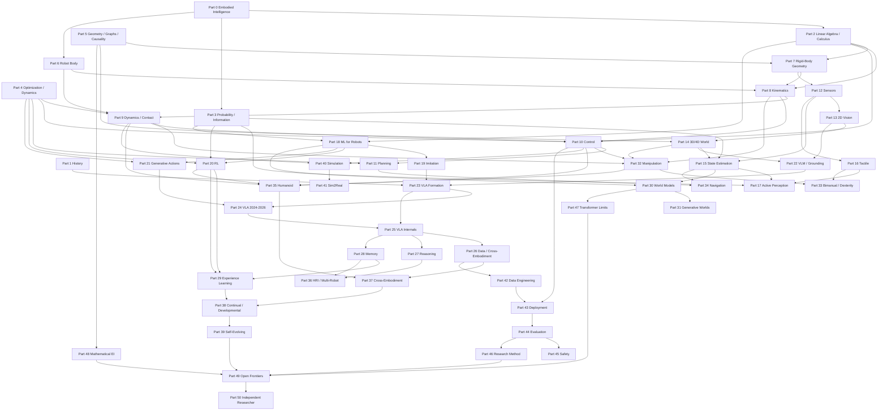
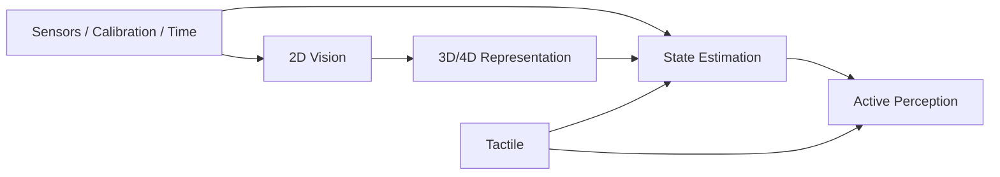
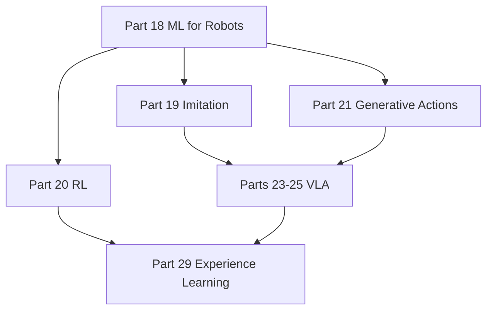
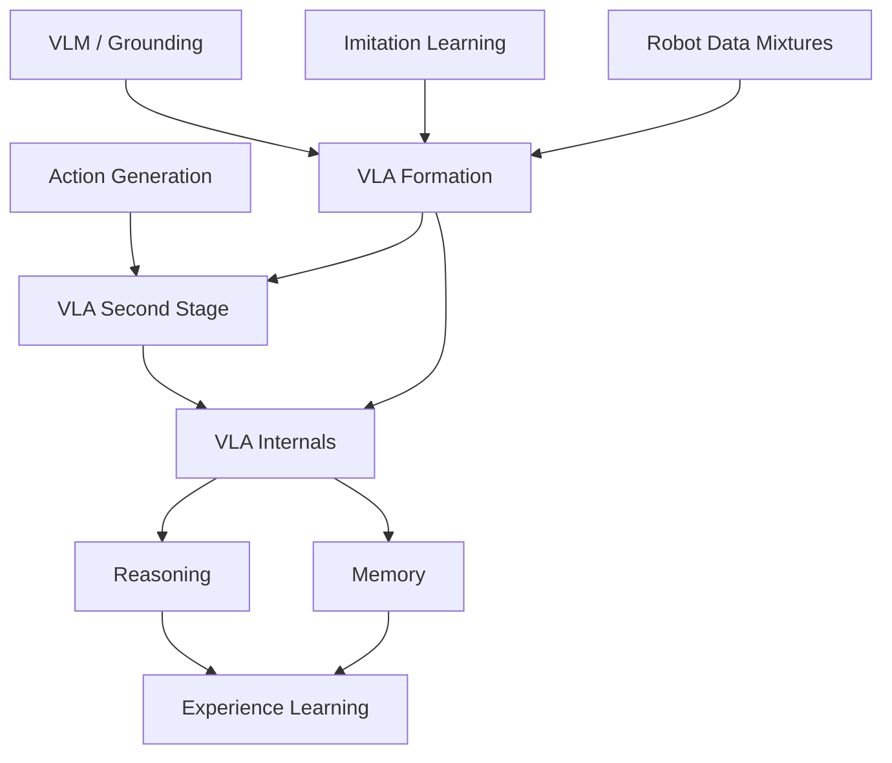
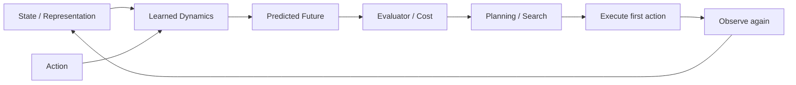
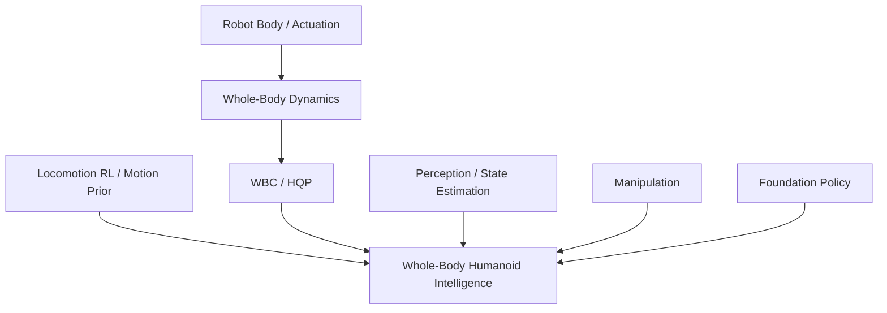
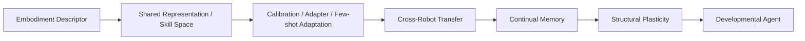
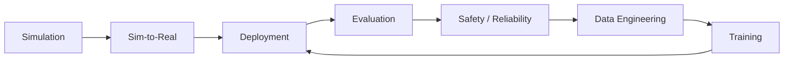
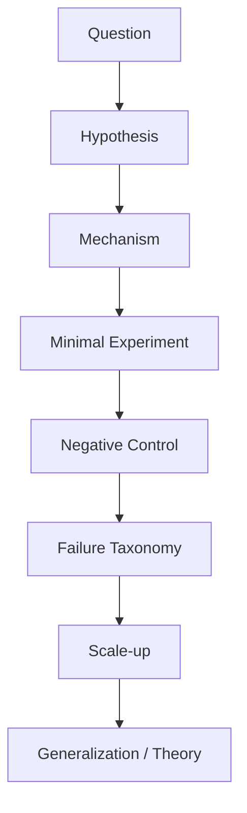

# Knowledge Dependency Graph

> The table of contents is linear because books are read linearly. The knowledge itself is not. This file exposes the prerequisite graph so readers can enter from different backgrounds without losing the dependency structure.

# 1. Global graph



---

# 2. Classical robotics dependency chain

```mermaid
flowchart LR
    LA[Linear Algebra] --> SE3[SO(3) / SE(3)]
    SE3 --> FK[Forward Kinematics]
    FK --> J[Jacobian]
    J --> IK[Inverse Kinematics]
    IK --> CTRL[Task / Joint Control]
    DYN[Dynamics] --> CTRL
    CONTACT[Contact] --> CTRL
    CTRL --> PLAN[Motion / TAMP]
```

Minimal prerequisite order:

```text
Part 2 → 7 → 8 → 9 → 10 → 11
```

If you skip Part 7, later pose/action conventions become fragile. If you skip Part 9, learned control/contact claims are hard to evaluate physically.

---

# 3. Perception and state dependency chain



Core principle:

> active perception should consume an explicit uncertainty/belief estimate; otherwise “move the camera around” is not yet an information-seeking policy.

---

# 4. Robot-learning dependency chain



Important asymmetry:

- imitation gives strong priors but weak recovery;
- RL supplies interaction-based improvement but is expensive/risky;
- generative action models handle multimodality but do not solve state uncertainty by themselves.

---

# 5. VLA dependency chain



A student should not enter Part 24 before understanding:

- Part 19: what distribution a demonstration defines;
- Part 21: how actions are generated and executed;
- Part 22: what language/vision grounding contributes;
- Part 23: the first VLA architecture family.

---

# 6. World-model dependency chain



Required prerequisites:

```text
Part 3 uncertainty
+ Part 4 dynamics/decision
+ Part 15 state estimation
+ Part 21 action representation
→ Part 30 world models
```

This makes it explicit why a video generator alone is not automatically a planning world model.

---

# 7. Humanoid dependency chain



Humanoid is therefore a convergence chapter rather than an isolated model family.

---

# 8. Cross-embodiment and continual learning



Key distinction:

> cross-embodiment asks whether capability can move across bodies; continual learning asks whether capability can accumulate across time. A developmental agent eventually needs both.

---

# 9. Infrastructure dependency chain



This is a closed engineering/scientific loop: deployment produces new failures and data, which should return into training and evaluation.

---

# 10. Research methodology dependency chain



This graph should be applied to every capstone and research project in the repository.

---

# 11. Entry points by background

## Deep-learning background

Start:

```text
Part 0 → 6–12 → 15 → 18–26 → 30 → 43–46
```

Then fill math gaps from Parts 2–5 as required.

## Robotics/control background

Start:

```text
Part 0 → 18–26 → 27–31 → 37–39 → 46–49
```

## Computer-vision background

Start:

```text
Part 0 → 6–12 → 13–17 → 18–26 → 30–31
```

## Foundation-model background

Do **not** start only at Part 23. Minimum prerequisite bridge:

```text
Part 6 → 7 → 8 → 9 → 10 → 12 → 15 → 19 → 21 → 22 → 23
```

---

# 12. Dependency maintenance rule

When adding a new chapter or major topic, update this graph with:

1. prerequisites;
2. outputs consumed downstream;
3. whether the dependency is mathematical, physical, algorithmic or engineering;
4. whether the new node is truly fundamental or only a case study.

A book chapter that has no clear incoming or outgoing knowledge dependency should be treated with suspicion: it may be a temporary trend rather than part of the durable curriculum.
