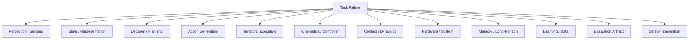

# Failure Atlas — 具身智能全栈失败分类、诊断与反证

> 机器人“失败”不是一个类别。一个抓取失败可能来自 camera timestamp、pose frame、world model、action chunk、IK、controller saturation、friction、motor thermal、dataset bias 或 benchmark reset。把所有 failure 都归因于 policy，会直接产生错误科研结论。

本 Atlas 的目标是建立：

```text
Symptom
→ Candidate Layer
→ Diagnostic Signal
→ Intervention / Negative Control
→ Root Cause
→ Research Question
```

---

# 1. 全栈 Failure Tree



诊断顺序原则：**先排除低层确定性错误，再解释高层智能失败。**

---

# 2. Sensor / Calibration Failures

## F-SEN-01　Camera Intrinsic 错

### 症状

- 2D 检测看起来正常；
- back-projected point cloud 尺度/位置系统偏差；
- reaching 总在目标旁边。

### 检查

重投影：

$$
\hat p_{uv}=\pi(K,T,p_{3D})
$$

计算 pixel reprojection error。

### 负对照

直接给 ground-truth object pose。若 policy 恢复，问题不在 action model。

---

## F-SEN-02　Camera Extrinsic 漂移

### 症状

机器人移动后误差方向近似固定；重新标定短期恢复。

### Root Cause

$$
{}^BT_C
$$

与真实 mounting 变换不一致。

### 研究风险

容易被误判成“视觉 backbone 对新视角不鲁棒”。

---

## F-SEN-03　Depth Scale / Missing Depth

### 症状

- RGB 识别准确；
- z 方向 reaching 误差大；
- 反光/黑色物体失败明显。

### 诊断

按 material / distance 分组统计 depth invalid ratio。

---

## F-SEN-04　Timestamp Misalignment

### 症状

机器人慢速时正常，高速时位置预测总落后；动作像“追着过去的物体跑”。

### 形式

训练实际对应：

$$
(o_t,a_{t+\delta})
$$

而不是：

$$
(o_t,a_t)
$$

### 最小实验

人工注入 10/20/50/100 ms delay 画 success curve。

---

## F-SEN-05　Multi-Sensor Clock Drift

### 症状

长 episode 前半正常、后半越来越不同步。

### 检查

比较硬件时间戳差：

$$
\Delta t(t)
$$

是否随 wall time 线性增长。

---

# 3. Coordinate / Geometry Failures

## F-GEO-01　Frame Convention 错

典型：

```text
world delta 被当成 end-effector delta
camera point 没转到 base
T_AB / T_BA 反了
```

### 症状

在特定 robot orientation 下正常，旋转 robot base 后完全错误。

### 最强测试

随机整体旋转场景。如果模型真是几何正确，结果应按预期 equivariant。

---

## F-GEO-02　Quaternion Order 错

`wxyz` vs `xyzw`。

### 症状

position 正常，orientation 呈奇怪大角度跳变。

### 防御

所有 API 边界写 assert + round-trip test。

---

## F-GEO-03　Degrees / Radians

### 症状

小角度似乎还能动，大动作直接发散。

### 防御

变量名包含 `_rad` / `_deg`；禁止匿名 angle scalar。

---

## F-GEO-04　SE(3) Delta 左乘 / 右乘混淆

body-frame：

$$
T_{t+1}=T_t\Delta T
$$

world-frame：

$$
T_{t+1}=\Delta T T_t
$$

二者完全不同。

---

# 4. Representation Failures

## F-REP-01　Semantic Strong, Metric Weak

### 症状

能说出物体是什么，却抓不准位置。

### 诊断

比较：

- object classification；
- pose/depth probe；
- precise reaching。

若前者高、后两者低，就是典型 semantic–geometry gap。

---

## F-REP-02　Background Shortcut

### 症状

换桌布/灯光成功率暴跌，物体与几何不变。

### 干预

背景随机化 vs object-preserving background swap。

---

## F-REP-03　Object Identity Lost Across Time

### 症状

多物体长任务中 memory 把同类物体混淆。

### 检查

object correspondence / instance consistency，而不只 frame-level detection。

---

## F-REP-04　Physics-Blind Representation

保持 appearance，改变：

- mass；
- friction；
- articulation；
- compliance。

如果 representation / policy 完全不响应，说明它主要编码视觉相关性。

---

# 5. State Estimation Failures

## F-STATE-01　Overconfident Belief

### 症状

模型在遮挡下给极确定 pose，但实际误差大。

### 检查

calibration：

$$
P(error<\epsilon\mid confidence=c)
$$

---

## F-STATE-02　Filter Divergence

### Root Causes

- wrong process model；
- wrong Q/R；
- bad data association；
- linearization error。

### 症状

innovation 持续偏大且 covariance 反而越来越小。

---

## F-STATE-03　Hidden State Missing

单帧无法区分：

- door locked/unlocked；
- object already grasped/slipping；
- previous subtask done/not done。

表现为相同 image 下 action 不稳定。

根本问题不是视觉 encoder，而是 observation history / memory 不充分。

---

# 6. Grounding / Reasoning Failures

## F-REA-01　Correct Language, Wrong Grounding

“拿起红杯子”语言理解正确，但 attention/grounding 指向另一个红物体。

### 诊断

把 grounding candidate 显式可视化，分离 language reasoning 与 physical binding。

---

## F-REA-02　Plausible Plan, Impossible Geometry

LLM 给出的步骤语义合理，但当前 robot 根本够不到。

### 修复层

feasibility / motion planner，不是继续 prompt engineering。

---

## F-REA-03　Narrated Reasoning 不影响 Action

模型输出漂亮 reasoning，但删掉/打乱 reasoning 后动作几乎不变。

### 结论

不能 claim reasoning causes behavior。

---

## F-REA-04　Plan Drift

长任务执行后环境已变，planner 仍按旧 symbolic state 继续。

### 必需结构

```text
execute
→ verify
→ update state
→ replan
```

---

# 7. Action Generation Failures

## F-ACT-01　Mode Averaging

MSE policy 在两个合法动作模式之间输出均值。

### 测试

构造 symmetric two-path task。

### 候选方法

mixture / diffusion / flow / AR。

---

## F-ACT-02　Action Quantization

离散 token 太粗，精细 insertion 持续有残差。

### 诊断

增加 bins；若性能跟 bins 单调改善，说明 action precision 是瓶颈。

---

## F-ACT-03　Wrong Action Scaling

训练 normalized action，部署 denormalization stats 错。

### 症状

所有方向都对但幅值系统偏大/偏小。

---

## F-ACT-04　Action Frame 错

`Δx` 在 ee frame 训练，却在 base frame 执行。

### 症状

ee orientation 改变后动作方向随之错误。

---

## F-ACT-05　Chunk Boundary Discontinuity

两个 action chunks 在连接处 velocity jump。

### 指标

$$
J_{boundary}=\|a_{t^-}-a_{t^+}\|
$$

以及 jerk。

---

# 8. Temporal Execution Failures

## F-TIME-01　Stale Action

模型 300 ms 前看到的世界，动作现在才执行。

### 测量

每个 command 记录：

```text
observation timestamp
inference start/end
execution timestamp
```

真正 age：

$$
T_{age}=t_{exec}-t_{obs}
$$

---

## F-TIME-02　Chunk Too Long

静态任务成功，动态 perturbation 后不能及时改计划。

### 实验

画：

$$
Success(H_{chunk}, disturbance\ rate)
$$

---

## F-TIME-03　Async Race Condition

sensor thread 更新 image，但 state 仍来自旧时刻，policy 得到混合 observation。

### 防御

timestamped snapshot / sequence version。

---

## F-TIME-04　Temporal Aggregation Lag

平滑器减少抖动，但在快速目标变化中反应太慢。

需要同时测 smoothness 与 phase lag。

---

# 9. IK / Controller Failures

## F-CTRL-01　IK Unreachable

policy 给出视觉上合理但 kinematically impossible target。

### 检查

IK status、distance-to-reachable-set，而非把失败算进 VLA。

---

## F-CTRL-02　Jacobian Singularity

### 症状

末端目标很小，joint velocity 极大。

### 修复

DLS、null-space posture、trajectory redesign。

---

## F-CTRL-03　Joint Limit Collision

末端 pose 可达，但特定 IK branch 撞 joint limit/self-collision。

### 根因

task-space target 不足以唯一决定 safe joint configuration。

---

## F-CTRL-04　Controller Bandwidth 不够

policy command 变化快于 low-level system 可跟踪。

### 指标

command vs measured tracking transfer function / phase lag。

---

## F-CTRL-05　Too Stiff for Contact

高 gain 在 free-space 精准，但 contact 产生冲击、振荡或 object damage。

### 对比

position control vs impedance / force-aware control。

---

# 10. Contact / Dynamics Failures

## F-CON-01　Friction Shift

视觉相同、摩擦变化后 slip。

这是检验 physical adaptation 的经典 intervention。

---

## F-CON-02　Payload / Mass Shift

轻物体示范迁移到重物体时：

- trajectory 跟踪变差；
- gripper force 不足；
- humanoid balance 改变。

---

## F-CON-03　Contact Mode Error

模型以为仍在 free space，实际已接触；或相反。

需要 tactile/force/contact estimator。

---

## F-CON-04　Deformable State Underrepresented

cloth/rope 不能由单一 rigid pose 表示。

如果 state representation 本身错，换 policy backbone 解决不了。

---

# 11. World Model Failures

## F-WM-01　Good One-Step, Bad Rollout

### 症状

短期 prediction loss 很低，MPC 长 horizon 发散。

### 必测

error vs horizon。

---

## F-WM-02　Video Plausible, State Wrong

视频自然，但 object pose/contact 不精确。

### 结论

visual realism 不能代替 control metric。

---

## F-WM-03　Action Insensitive

换 candidate action，predicted future 几乎不变。

### 结论

不是合格 counterfactual control model。

---

## F-WM-04　Policy Ignores World Model

用 random/shuffled world model，policy success 不变。

### 结论

不能声称 prediction 帮助 control。

---

# 12. Memory Failures

## F-MEM-01　Retrieves Semantically Similar but Physically Wrong Episode

文本相似不等于 spatial/embodiment/context 相似。

retrieval key 应包含：

- task；
- scene；
- object；
- embodiment；
- failure mode。

---

## F-MEM-02　Memory Staleness

物体已被人移动，但 long-term memory 仍当作当前世界事实。

必须区分：

```text
historical memory
current belief
```

---

## F-MEM-03　Memory Growth Without Consolidation

episode 永久追加，retrieval 越来越慢、冲突越来越多。

这不是 lifelong intelligence，只是 log accumulation。

---

## F-MEM-04　Catastrophic Overwrite

新经验更新 semantic memory 后，旧场景规律丢失。

需要 regression suite / retention matrix。

---

# 13. Cross-Embodiment Failures

## F-XEMB-01　Robot-ID Memorization

多机器人 training 都成功，但 unseen robot 完全失败。

### 结论

这是 multi-robot fitting，不是 morphology generalization。

---

## F-XEMB-02　Padding Shortcut

joint vector padding 到固定长度，模型学会“第 8 维永远对应 elbow”。

新拓扑后失效。

### 候选修复

graph/morphology-conditioned representation。

---

## F-XEMB-03　Same Task, Different Effect Interface

不同 embodiment 实现同任务需要不同 intermediate effects。

共享 action token 不一定是正确 abstraction。

---

# 14. Continual / Developmental Failures

## F-CONT-01　Catastrophic Forgetting

新任务提升，旧任务 performance matrix 明显下降。

必须报告：

$$
P_{i,j}
$$

而不是只报 final average。

---

## F-CONT-02　Linear Resource Growth

每学一个 task 新增一个完整 module。

能力上涨，但 parameter/memory 几乎按 task 数线性增长。

不能轻易称 scalable continual intelligence。

---

## F-CONT-03　Human-Hidden Learning Loop

所谓 autonomous learning 实际依赖：

- 人工 reset；
- 人工 reward；
- 人工筛选数据；
- 人工选择 checkpoint。

必须报告 autonomy ratio。

---

## F-CONT-04　Unsafe Update

在线更新后旧 safety constraint 被破坏。

需要每次 consolidation 后跑 safety regression suite。

---

# 15. Data Failures

## F-DATA-01　Train/Test Leakage

不仅 identical episode：

- same object instance；
- same scene asset；
- same task template；
- pretrained web overlap。

foundation-model 时代必须明确可能的不可控预训练 overlap。

---

## F-DATA-02　Success-Only Dataset

policy 从未见过 recovery states。

部署一旦偏离 expert manifold，无法返回。

### 对照

加入少量 failure/recovery demonstration。

---

## F-DATA-03　Robot Imbalance

一个机器人占 90% 数据，所谓 cross-robot model 实际主要优化该机器人。

报告 dataset mixture 与 sampling weights。

---

## F-DATA-04　Silent Schema Change

某批数据 action 从 meters 改 centimeters / quaternion order 改了，但版本没更新。

这是最危险的数据工程错误之一。

---

# 16. Simulation / Sim-to-Real Failures

## F-SIM-01　Solver Artifact Exploitation

policy 学会模拟器里不真实的接触/摩擦行为。

### 测试

cross-simulator transfer。

---

## F-SIM-02　Visual Randomization 掩盖 Dynamics Gap

换很多纹理但摩擦/延迟完全错误，视觉 sim2real 很强仍真机失败。

必须把 gap 分层。

---

## F-SIM-03　Randomization Too Wide

训练域极宽，policy 学成保守平均策略，真实域内反而精度低。

System ID + centered randomization 可能更好。

---

# 17. Hardware / System Failures

## F-HW-01　Thermal Throttling

开始 20 分钟正常，之后 compute/motor 温度上升，frequency/torque 下降。

性能随运行时间退化，不是 policy memory 问题。

---

## F-HW-02　Encoder Zero Drift

关机重启/碰撞后零位变化。

所有 action 看起来有固定偏差。

---

## F-HW-03　Network Jitter

平均 latency 不大，但长尾使少数 action 极 stale。

报告 percentile：

```text
p50 / p95 / p99 latency
```

---

## F-HW-04　Driver Saturation / Watchdog

policy 输出正常，但 driver clip 或 watchdog stop。

日志必须同时保存 raw action 与 actual command。

---

# 18. Evaluation Failures

## F-EVAL-01　Cherry-Picked Video

没有 denominator，无法推断 success probability。

---

## F-EVAL-02　Too Few Trials

7/10 → 8/10 不足以支撑大多数“显著提升” claim。

必须给 confidence interval。

---

## F-EVAL-03　Reset Advantage

某方法失败后人工把物体摆得更容易，但 benchmark 没记录。

reset protocol 是 evaluation 的一部分。

---

## F-EVAL-04　Different Controller / Hardware Across Baselines

模型对比实际上混入 controller/hardware 变化。

必须做 factorial control。

---

# 19. Safety-Layer “Failure”不一定是坏事

机器人停止任务可能因为 safety system 成功工作。

必须区分：

```text
unsafe policy action
safety intervention
mission failure
physical incident
```

如果 safety stop 被简单算作“policy failure”，会低估安全层价值；如果全部不算，又会掩盖模型不可靠。

建议同时报告：

- task success；
- safety intervention rate；
- incident rate；
- false-stop rate。

---

# 20. 一个标准 Failure Report

每次失败至少记录：

```text
Episode ID
Task / scene / object
Robot / embodiment
Failure timestamp
Raw observations before failure
State estimate
Model inputs
Model output
Executed command
Controller status
Contact / force
Safety event
Human intervention
Root-cause hypothesis
Confidence in diagnosis
```

并标记：

```text
observed fact
vs
inferred cause
```

不要把猜测直接写成 root cause。

---

# 21. Failure → Research Question

例：

### Observation

遮挡时 VLA 抓错目标。

### 不够好的研究问题

> 加一个更大的视觉 backbone？

### Failure decomposition

```text
object initially visible
→ later occluded
→ no persistent object state
→ policy re-grounds from current frame
→ identity lost
```

### 更好的问题

> 如何在长期部分可观测 manipulation 中维护可校正的 object-centric belief，而不是每帧重新 grounding？

### 可证伪实验

遮挡时长 × memory type × object similarity factorial design。

这就是 Failure Atlas 真正的用途：**不是修 bug，而是把重复失败提升成研究问题。**

---

# 22. 诊断的黄金顺序

机器人出现神秘失败时，建议按以下顺序，而不是先换模型：

```text
1. raw sensor correct?
2. timestamp aligned?
3. frame / unit / normalization correct?
4. state estimate correct?
5. target reachable?
6. model output semantically/physically sensible?
7. temporal executor stale?
8. controller tracks command?
9. contact physics changed?
10. hardware/driver healthy?
11. only then: architecture / reasoning / intelligence hypothesis
```

这是具身研究里最省 GPU、最省真机时间的一页。