# Canonical Figures — 《具身智能：从物理世界到通用机器人》

> 本页收录全书共用的**原创结构图**。全部使用 Mermaid，GitHub 可直接渲染；后续章节插图优先引用或派生自这些图，而不是每章重新发明一套视觉语言。
>
> 设计原则：先画**物理对象与数据流**，再画模型；所有箭头都尽量回答“什么量在流动”。

---

# Figure 1　具身智能的总闭环

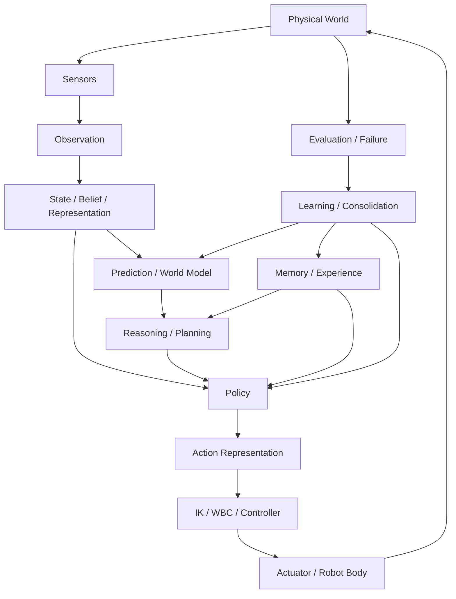

这张图是全书唯一的“总架构”。任何新技术都应能说明自己修改了哪一条边、哪一个状态或哪一个时间尺度。

---

# Figure 2　从任务意图到电机：Action 到底去了哪里

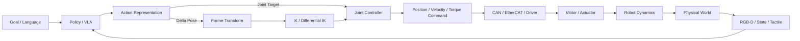

核心提醒：论文里的 `action` 通常不是电机电流。Action space 只是整个控制链中的一个接口。

---

# Figure 3　坐标系与 SE(3) 数据流

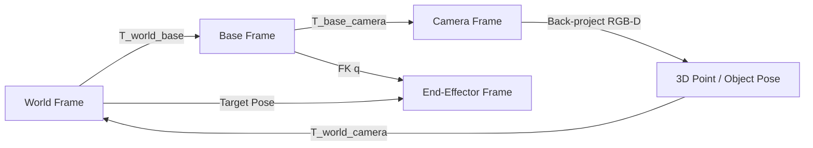

机器人系统中的大量“模型错误”其实是 frame convention、左右乘、四元数顺序或时间戳错误。

---

# Figure 4　经典机器人控制的多时间尺度层级

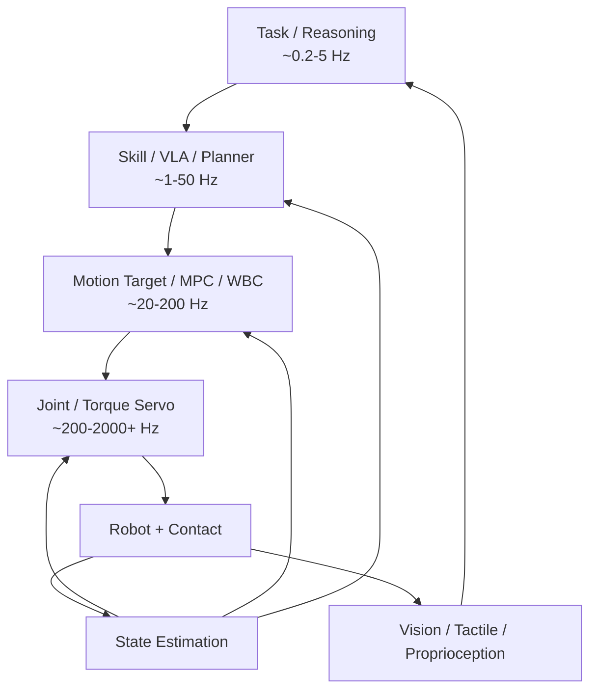

具体频率因硬件而异；图中数字表示典型数量级，而非标准值。关键是：**具身智能天然是 multi-rate system。**

---

# Figure 5　Robot Learning 数据闭环

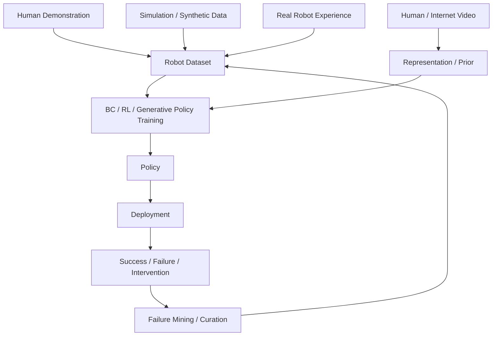

这张图把“大数据”从静态 dataset 改写成持续 data flywheel。

---

# Figure 6　BC → DAgger → RL → Experience Learning

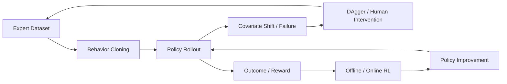

它展示了 Robot Learning 的逻辑递进：从“模仿专家分布”逐渐走向“根据自己产生的状态和结果继续学习”。

---

# Figure 7　生成式动作模型的统一视图

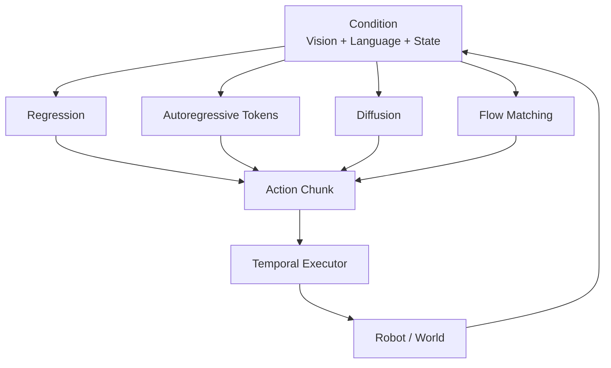

比较模型时必须固定 action horizon、control frequency、history、data 和 latency，否则“生成范式比较”不公平。

---

# Figure 8　现代 VLA 的共同结构

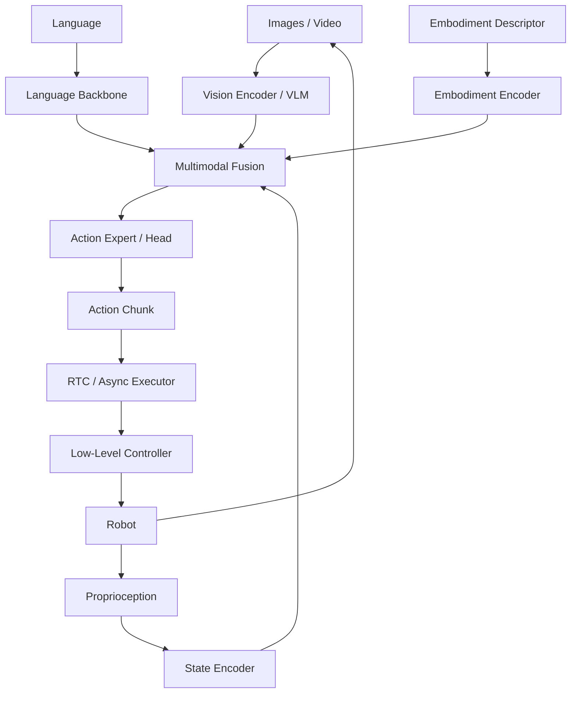

不同 VLA 的关键分歧主要发生在：representation 是否 joint-train、action generator 类型、embodiment conditioning、temporal execution 与 post-training。

---

# Figure 9　Reasoning、Memory 与 Policy 的分层

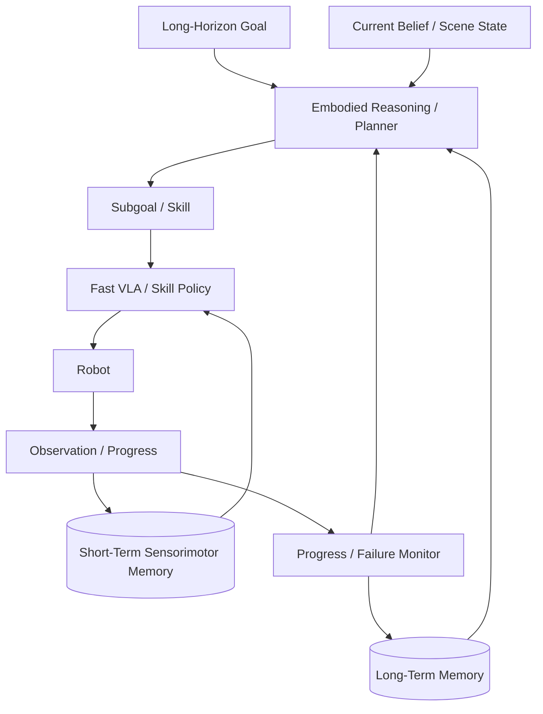

长任务不是“把 action chunk 拉长”，而是把不同时间尺度的记忆、计划、执行和验证闭环起来。

---

# Figure 10　World Model 的最小可用结构

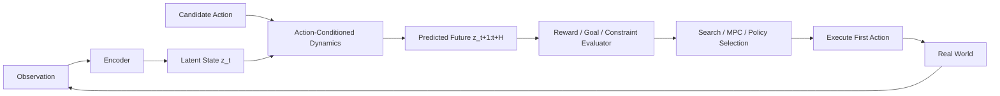

真正的检验不是 future video 好不好看，而是 **counterfactual prediction 是否改善真实 action selection**。

---

# Figure 11　主动感知：看哪里也是动作

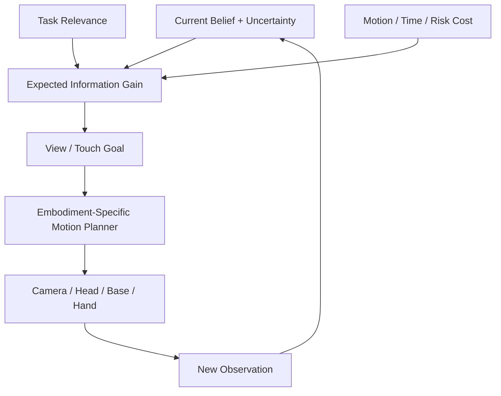

这一结构把高层“应该获取什么信息”与具体机器人“怎样移动去获取”分开，可自然支持 embodiment-agnostic sensing goal。

---

# Figure 12　双臂 / 灵巧操作的协调关系

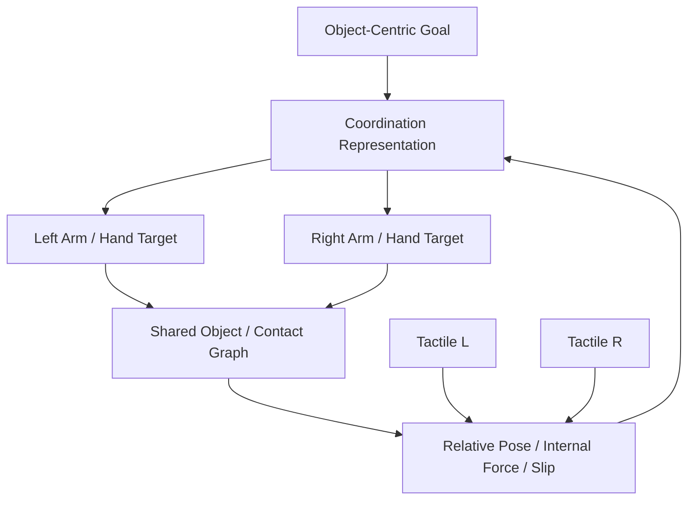

双臂的核心不是把 action vector 拼成两倍，而是建模共同对象、相对约束与 internal force。

---

# Figure 13　Whole-Body Humanoid：Feet-to-Fingertips

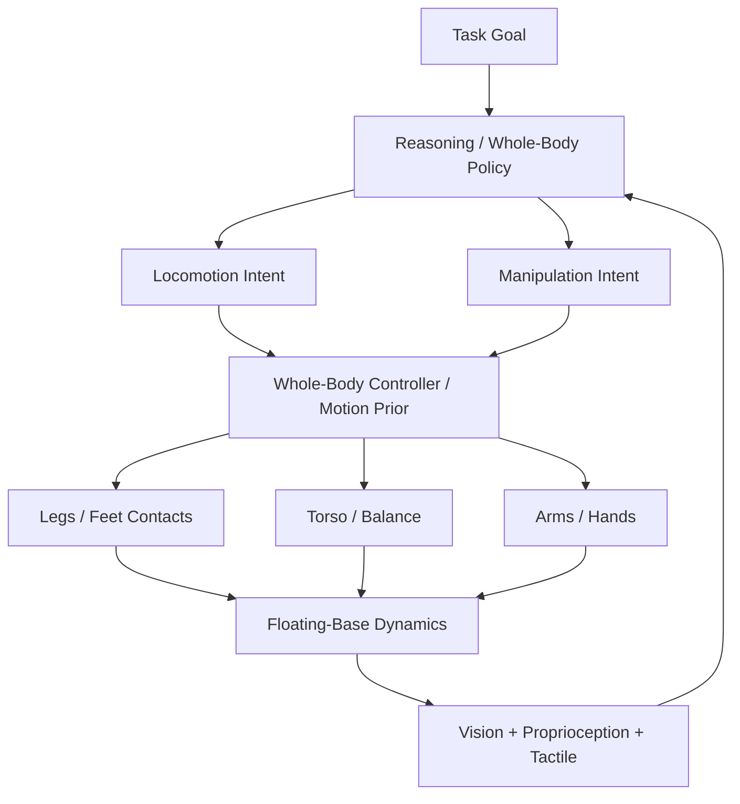

“全身 VLA”必须面对一个事实：手臂动作会改变 balance，腿部动作会改变 camera 和 arm workspace。

---

# Figure 14　Cross-Embodiment：从任务规律到不同身体

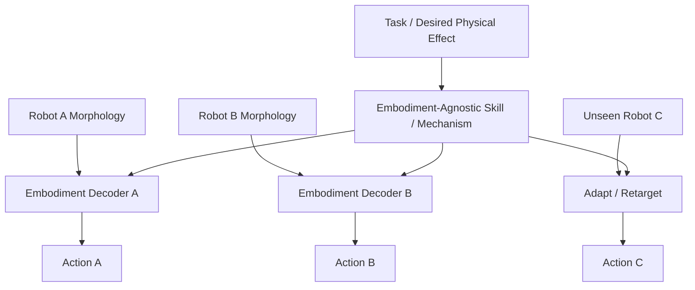

真正 cross-embodiment 的核心是共享 **effect / mechanism**，而不是把不同机器人的 joint vectors padding 到相同长度。

---

# Figure 15　Continual / Developmental / Self-Evolving Loop

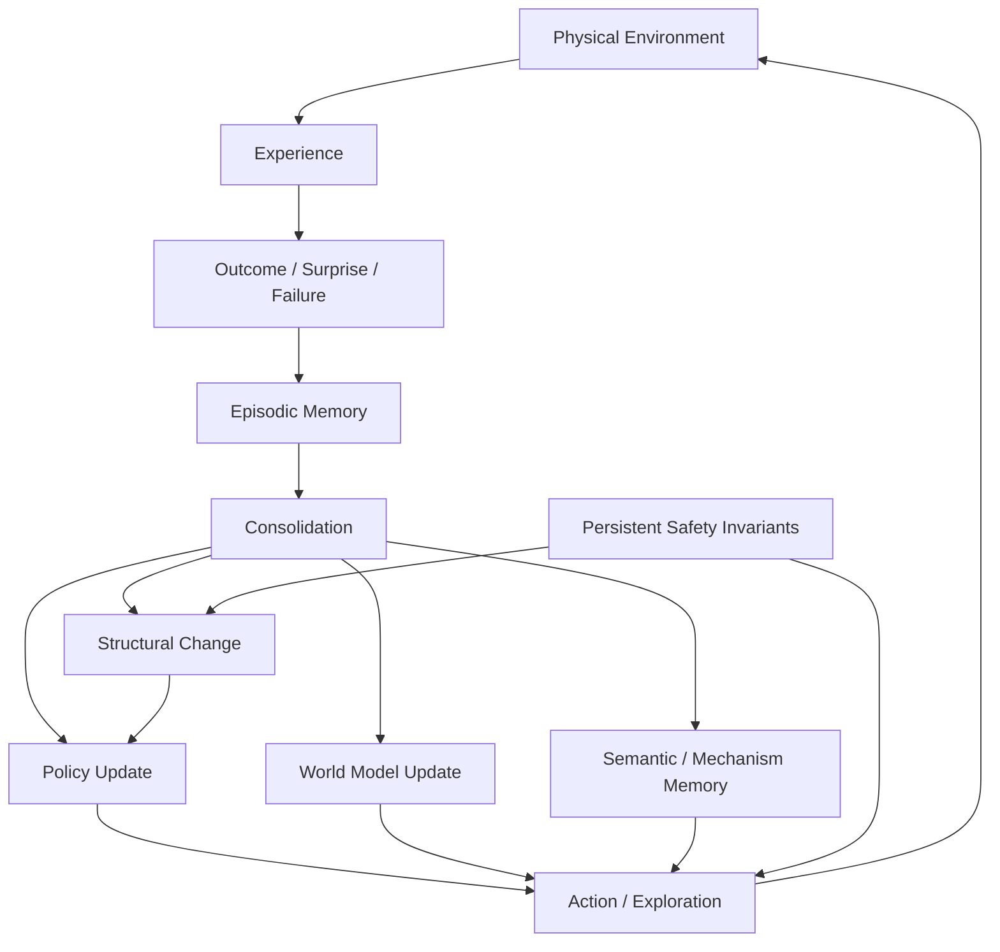

这张图刻意把 parameter update、memory formation 与 architecture change 分开：发展型智能不能被简化为 continual fine-tuning。

---

# Figure 16　从 Paper Claim 到可证伪科学结论

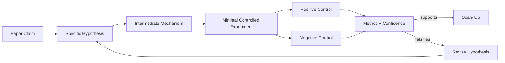

这是全书研究方法的核心：算力放在已经通过最小可证伪实验的问题上，而不是代替实验设计。

---

# Figure 17　全书知识依赖图

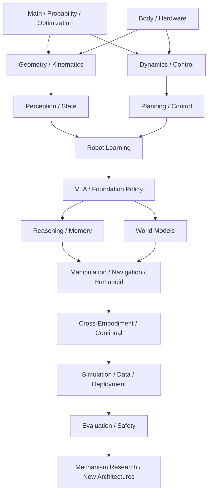

建议第一次学习时沿这张图顺序推进；做科研时则从某个 failure 反向追溯它依赖的基础层。

---

# 图示维护原则

1. **模型图必须同时画 action 执行端。** 不能只画到 policy output。
2. **坐标图必须写 frame。** `world/base/camera/ee/object` 不能省。
3. **时间图必须写频率或相对尺度。** 尤其 VLA、tactile、controller。
4. **表示图必须写 shape / object semantics。** 不允许只画“Encoder → Feature”。
5. **World Model 图必须含 action conditioning。** 否则只是视频预测。
6. **Reasoning 图必须含 execution feedback。** 否则只是 open-loop planner。
7. **Continual learning 图必须区分 memory、parameter、structure。**
8. 前沿模型的品牌架构图放入对应 Atlas；主教材优先保留能长期成立的机制图。