# Core Mechanism Diagrams

> 全书共用图谱。所有图使用 Mermaid，GitHub 可直接渲染。原则：**先画系统、变量、时间与 frame，再讲公式。**

---

# Figure 1 — Embodied Intelligence Closed Loop

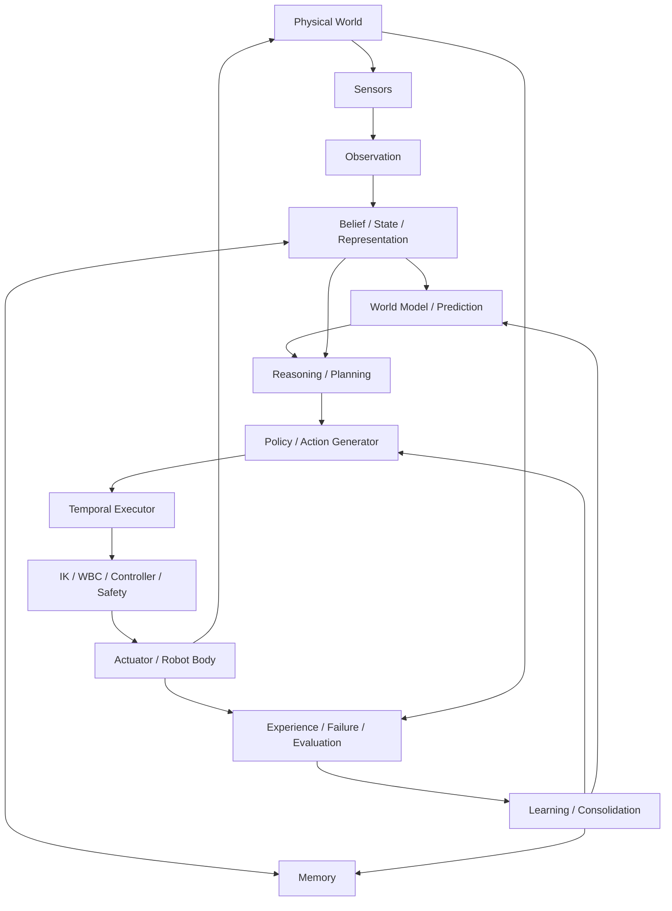

核心问题不是：

```text
input → model → output
```

而是：

```text
world → sensing → internal state → decision → physical action → changed world → new evidence
```

---

# Figure 2 — Policy Output Is Not Motor Torque by Default

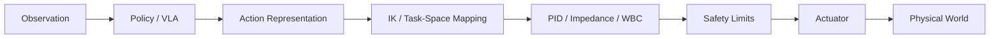

同一个“7-D action”可能是：

- Cartesian delta；
- target pose；
- joint delta；
- action token 解码结果。

如果 controller stack 不同，不能把 success 差异全归因于 policy。

---

# Figure 3 — Coordinate-Frame Chain

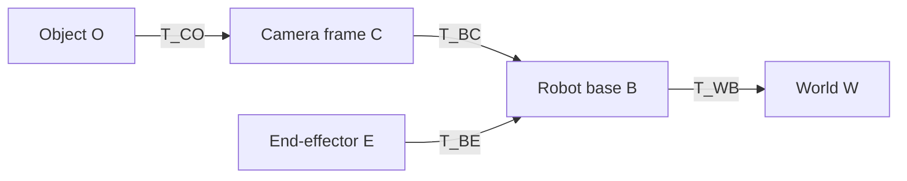

典型组合：

\[
T_{WO}=T_{WB}T_{BC}T_{CO}.
\]

任何 perception → action 系统都应明确每个 tensor 属于哪个 frame。

---

# Figure 4 — Multi-Rate Robot System

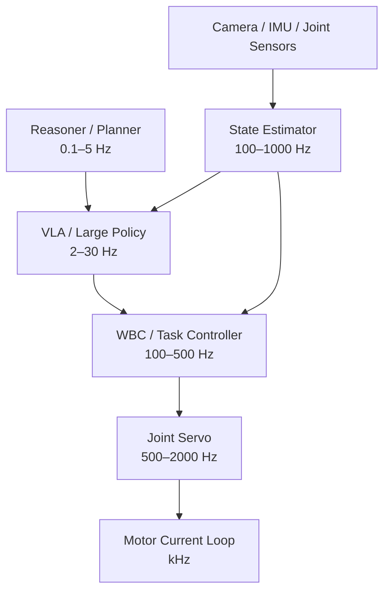

频率仅为常见量级示意，不是统一标准。重点是：**语义、policy、稳定控制不需要共用一个 clock。**

---

# Figure 5 — Classical Manipulator Mathematics

```mermaid
flowchart LR
    Q[Joint q]
    FK[Forward Kinematics]
    X[End-Effector Pose T]
    J[Jacobian J(q)]
    V[Twist V]
    DYN[Dynamics M,C,g]
    TAU[Torque τ]

    Q --> FK --> X
    Q --> J
    J --> V
    Q --> DYN
    TAU --> DYN
```

核心关系：

\[
V=J(q)\dot q,
\]

\[
M(q)\ddot q+C(q,\dot q)\dot q+g(q)=\tau+J^T\lambda.
\]

---

# Figure 6 — State Estimation vs Raw Observation

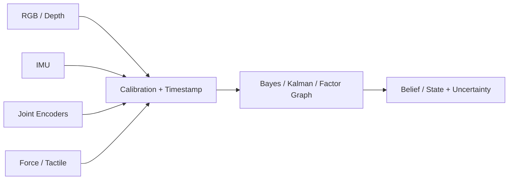

机器人真正用于决策的通常不是原始 sensor packet，而是带时空语义与不确定性的内部 state/belief。

---

# Figure 7 — Active Perception as Decision Under Information Value

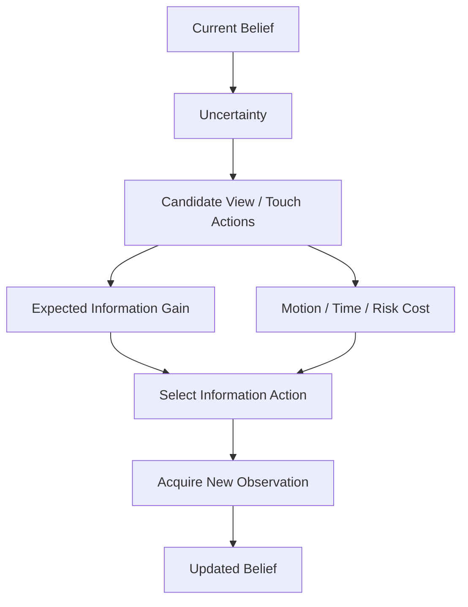

目标可抽象为：

\[
a^*=\arg\max_a \mathbb E[IG(a)]-\lambda C(a).
\]

---

# Figure 8 — Imitation Learning and DAgger

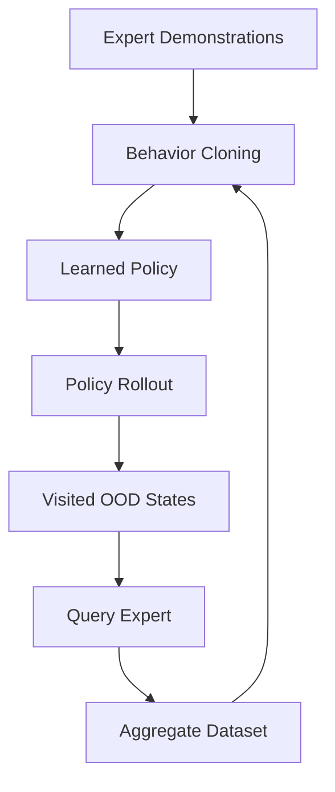

BC 的核心问题不是训练 loss，而是 policy 改变了自己未来访问的 state distribution。

---

# Figure 9 — Three Action-Generation Paradigms

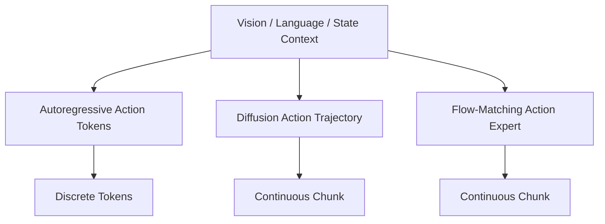

三者最大的差异是**动作表示与生成过程**，而不是是否使用 Transformer。

---

# Figure 10 — Modern VLA Stack

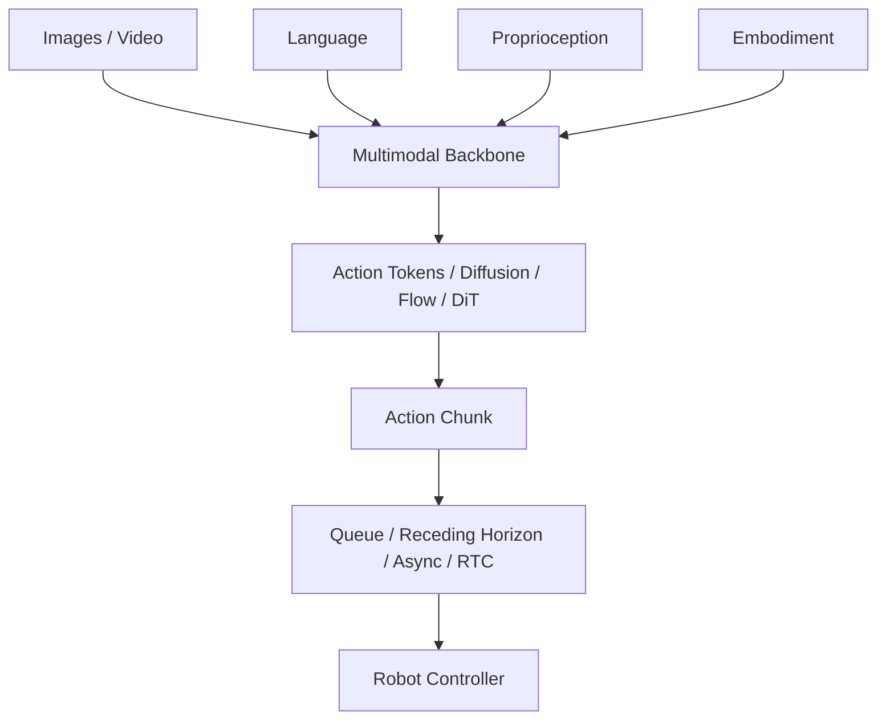

对 2026 VLA 的研究不能只停在 `BACK → HEAD`。

---

# Figure 11 — Action Token vs Continuous Expert

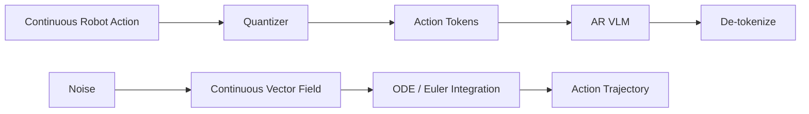

OpenVLA 类路线主要承担 quantization + token prediction error；flow 路线主要承担 vector-field + numerical-integration error。

---

# Figure 12 — Temporal Executor and Stale Action

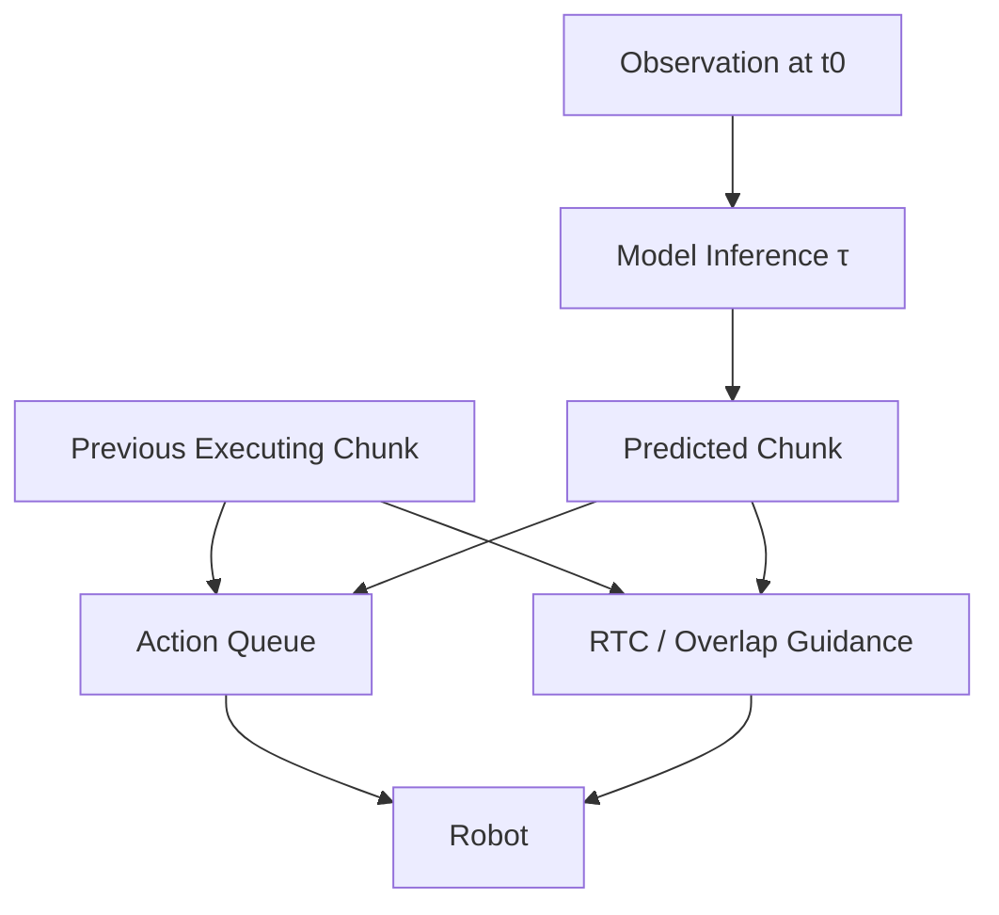

当：

\[
\tau_{inference}>\Delta t_{action},
\]

模型产生的动作在执行时已经基于旧世界状态。RTC / async execution 是系统问题，不是纯网络结构问题。

---

# Figure 13 — World Model Used for Control

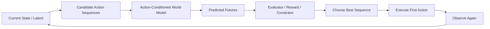

判断 world model 是否有用的关键不是 prediction loss，而是：

\[
J_{policy+WM}>J_{policy-no-WM}.
\]

---

# Figure 14 — Memory Is Not the Same as World Model

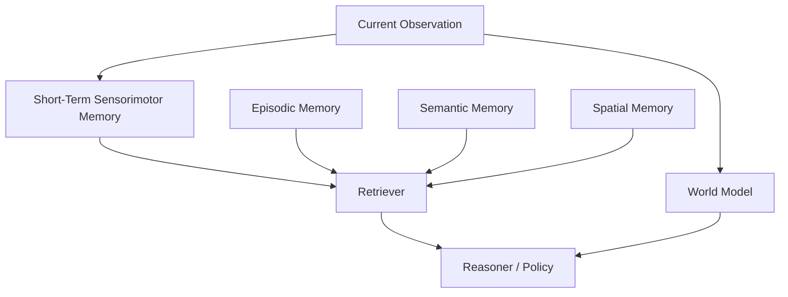

Memory回答“过去发生了什么 / 什么长期存在”；world model回答“如果做动作，未来可能怎样变化”。

---

# Figure 15 — Humanoid Whole-Body Stack

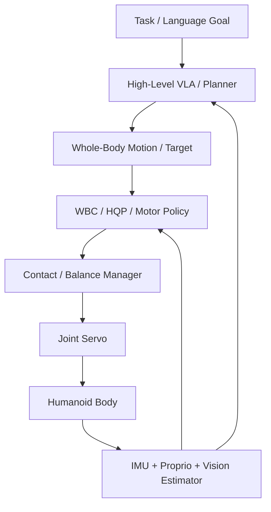

whole-body VLA 并不意味着 WBC、balance、servo 消失。

---

# Figure 16 — Cross-Embodiment Intelligence

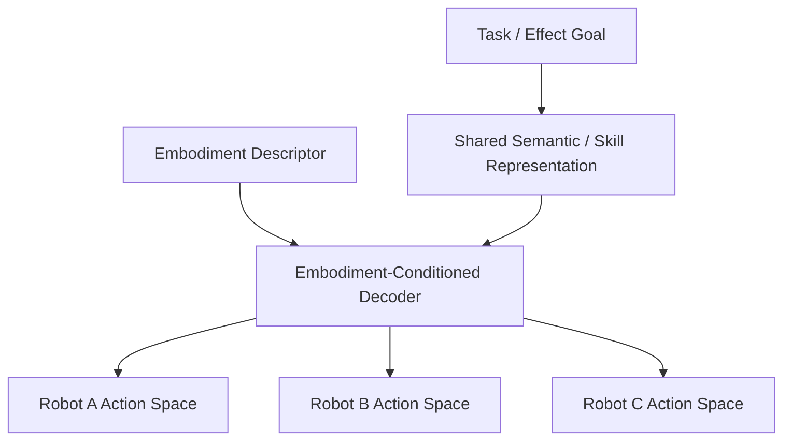

跨本体的核心不是把不同 joint vector 直接 padding，而是找到哪些能力应共享、哪些必须由身体条件化。

---

# Figure 17 — Continual / Developmental Learning Loop

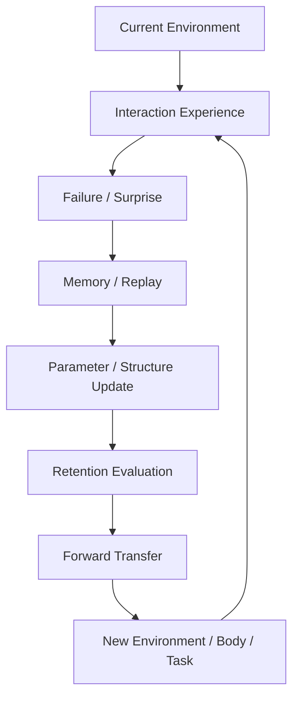

真正的 self-evolving system 必须同时记录：

\[
\text{new capability},
\quad
\text{retention},
\quad
\text{forward transfer},
\quad
\text{resource growth}.
\]

只增加参数或训练更多步不等于“发展”。

---

# Figure 18 — Scientific Research Loop

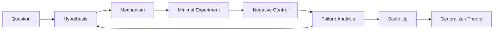

这张图是全书研究方法的最终闭环：**先让机制可证伪，再花大算力。**

---

# Figure usage rule

引用这些图时，不要只复制视觉布局。正文还应写清：

- 每个节点对应哪些变量 / tensor；
- 每条边的方向、频率和 frame；
- 哪些模块 trainable / frozen；
- 哪些是模型，哪些是 robot runtime；
- failure 最可能发生在哪条边。

一张真正有用的系统图必须能指导代码追踪和实验设计。
